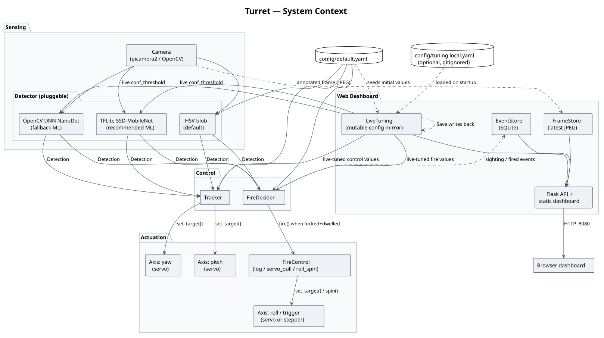
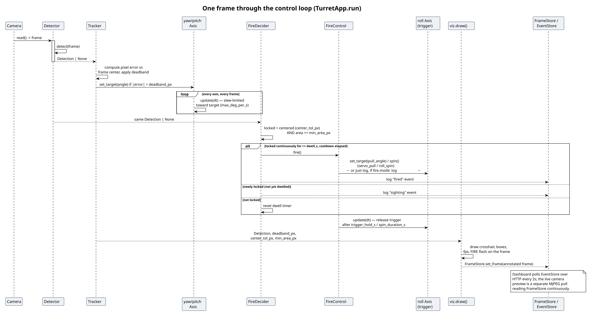

# Architecture

## Table of contents

- [System context](#system-context)
- [Module-by-module](#module-by-module)
  - [`camera/`](#camera--frame-source)
  - [`vision/`](#vision--the-detector-interface)
  - [`control/`](#control--tracker-and-firedecider)
  - [`actuators/`](#actuators--the-axis-interface)
  - [`webapp/`](#webapp--dashboard-and-live-state)
  - [`config.py` and `live_tuning.py`](#configpy-and-live_tuningpy)
  - [`app.py`](#apppy--the-orchestrator) — the orchestrator
  - [`selftest.py`](#selftestpy)
- [The control loop](#the-control-loop)
- [The config system](#the-config-system)
- [Safety model](#safety-model)
- [Test strategy](#test-strategy)
- [See also](#see-also)

## System context

*(source: [`diagrams/system-context.puml`](diagrams/system-context.puml))*

Everything downstream of the camera reads a `Detection | None` produced by
whichever `Detector` backend is configured; everything downstream of that
reads the same value for both tracking (where to point) and fire decisions
(when to fire). Config flows in from `config/default.yaml` at startup and,
when the dashboard is enabled, a subset of it can be overridden live via
`LiveTuning` — which is itself optionally seeded from and saved back to a
second, gitignored file (`config/tuning.local.yaml`) that never touches the
checked-in default.

## Module-by-module

The package lives under `src/turret/`. Each subpackage owns one concern and
talks to the others through a small, explicit interface — this is what
makes the mock-hardware testing strategy possible (see
[Test strategy](#test-strategy)).

### `camera/` — frame source

`Camera` (`base.py`) is a two-method interface: `read() -> frame | None`
and `resolution`. Two implementations:

- `CvCamera` — `cv2.VideoCapture`, used for USB webcams, video files (dev
  machines), and as the fallback path.
- `PiCamera` — `picamera2`/libcamera, the real Pi CSI camera path.

`camera/factory.py`'s `open_camera()` tries `picamera2` first when
`backend: auto` (the default) and falls back to OpenCV if it's unavailable
— so the exact same config works on a dev laptop (no picamera2 installed)
and on the Pi (no `/dev/video0`-style plain webcam device) without
changing anything.

### `vision/` — the `Detector` interface

`Detector.detect(frame_bgr) -> (Detection | None, debug_img)`
(`vision/base.py`) is the one interface three backends implement — see
[Stack & Rationale](stack.md#detection-three-tiers-not-one) for *why*
three, and the [detector-backends diagram](diagrams/detector-backends.svg)
for the shape. `vision/factory.py`'s `build_detector()` picks one by
`cfg.detector_backend`, and — this matters for live tuning — accepts an
optional `ml_detection` override so the ML backends can be constructed
against a `LiveTunable` mirror instead of the frozen config (see
[The config system](#the-config-system)).

`vision/postprocess.py` holds the pure, model-format-specific decode logic
(SSD box decoding, label-file parsing, NMS) factored out of the two ML
detectors specifically so it's unit-testable without a model file or an ML
runtime installed — the largest test file in the suite
(`tests/test_postprocess.py`) tests this module alone.

### `control/` — `Tracker` and `FireDecider`

- **`Tracker`** (`tracker.py`): pixel error from frame center → yaw/pitch
  `set_target()` calls, gated by a deadband and clamped by a max-step so
  motion never over-corrects.
- **`FireDecider`** (`fire.py`): "locked" means centered within tolerance
  *and* big enough (area ≥ threshold); "fire" means locked continuously for
  `dwell_s` with `cooldown_s` elapsed since the last fire. This is pure
  decision logic — it never touches hardware.
- **`FireControl`** (also `fire.py`): the *how*, separate from the
  `FireDecider`'s *when*. Three implementations behind
  `make_fire_control()`: `LogFireControl` (default, actuates nothing),
  `ServoPullFireControl`, `RollSpinFireControl`. `make_fire_control()`
  validates the requested mode against the roll axis's actual capability
  (`Axis.supports_spin`) at construction time — a `roll_spin` config
  against a servo-backed roll axis fails at startup, not on the first
  attempted fire.

### `actuators/` — the `Axis` interface

`Axis` (`base.py`): `set_target(deg)`, `update(dt)` (slew-rate-limited
motion, ported from the ESP32Servo Sweep example's math), `angle()`,
`spin()`/`stop_spin()` (continuous rotation — off by default, only
`StepperAxis` and `MockAxis` support it via the `supports_spin` class
attribute). Three implementations: `ServoAxis` (pigpio PWM), `StepperAxis`
(28BYJ-48 half-stepping via a background thread), `MockAxis` (pure
software, used for every test and for `--mock` runs).
`actuators/factory.py`'s `build_axes()` is the *only* module that decides
whether real GPIO is available — everything else works purely against the
`Axis` interface, mock or real.

### `webapp/` — dashboard and live state

Three small, focused pieces, each independently optional:

- **`store.py` — `EventStore`**: append-only SQLite log of `sighting` and
  `fired` events. One connection per call (no shared connection object) —
  simple and correct for the dashboard's low write rate.
- **`frames.py` — `FrameStore`**: the latest annotated frame, JPEG-encoded,
  behind a lock. One producer (the control loop), any number of readers
  (dashboard viewers), overwritten rather than queued — a slow viewer just
  sees the newest frame next time it polls.
- **`server.py`**: the Flask app — static dashboard page, `/api/events`,
  `/api/stream.mjpg` (MJPEG multipart, reading `FrameStore`), and
  `/api/tuning` + `/api/tuning/reset` + `/api/tuning/save` (reading/writing
  a `LiveTuning`). All three data sources are optional constructor
  arguments; a route 503s cleanly if its backing store wasn't provided
  (e.g. the dashboard run standalone with no camera loop attached).

### `config.py` and `live_tuning.py`

Covered in detail in [The config system](#the-config-system) below — this
is the least obvious mechanism in the codebase and worth understanding on
its own.

### `app.py` — the orchestrator

`TurretApp.run()` is the only place that wires everything above together:
build axes → open camera → build detector/tracker/decider/fire-control →
loop. It owns the frame-pacing (`period = 1/fps`, sleep out the remainder
of each iteration) and decides, based on `--headless`/`--dashboard`,
whether to draw the debug overlay, show a local `cv2` window, and/or push
frames to the dashboard. See [The control loop](#the-control-loop) for the
per-frame sequence.

### `selftest.py`

A separate entry point (`--selftest`) that builds the same subsystems
`app.py` would, exercises each one, and reports `[PASS]/[WARN]/[FAIL]`
without starting the control loop. See
[Deployment & Operations](deployment-and-ops.md#pre-run-self-test) for the
operational story; the safety-relevant detail —
**it never actuates the trigger axis unless `--actuate-trigger` is
explicitly passed** — is covered in [Safety model](#safety-model) below.

## The control loop

*(source: [`diagrams/control-loop-sequence.puml`](diagrams/control-loop-sequence.puml))*

One iteration of `TurretApp.run()`'s `while True:` loop, in order:

1. **Read a frame.** `None` means the camera stopped yielding frames — the
   loop logs an error and exits (systemd's `Restart=always` picks it back
   up on the Pi; see [Deployment & Operations](deployment-and-ops.md)).
2. **Detect.** One `Detector.detect(frame)` call, regardless of backend.
3. **Track.** `Tracker.update(det, dt)` — moves yaw/pitch targets if the
   error exceeds the deadband.
4. **Slew every axis.** `Axis.update(dt)` for every configured axis,
   independent of whether that axis just got a new target — this is what
   makes motion continuous and rate-limited rather than teleporting.
5. **Decide.** `FireDecider.locked(det)` (for the dashboard's "sighting"
   event) and `FireDecider.update(det, dt)` (the dwell/cooldown state
   machine; returns `True` exactly once per successful lock-and-dwell).
6. **Act.** On a `True` from step 5: `FireControl.fire()` — logs only, or
   actuates the roll axis, depending on `fire.mode`.
7. **Draw and publish.** If a local window or the dashboard needs it,
   `viz.draw()` renders the crosshair/deadband/fire-tolerance boxes and
   detection box onto the frame; the dashboard branch also pushes it to
   `FrameStore`.
8. **Pace.** Sleep out whatever's left of the frame period.

## The config system

`config.py` defines the whole config as a tree of **frozen** (immutable)
dataclasses — `TurretConfig` → `ControlConfig`, `FireConfig`,
`MLDetectionConfig`, `AxisConfig` (× yaw/pitch/roll), etc. `load_config()`
starts from `TurretConfig()`'s hardcoded defaults and recursively merges in
whatever's present in the YAML file, so `config/default.yaml` only needs to
specify what it wants to *change* from the code-level defaults.

Immutability is deliberate: it means every part of the codebase that holds
a config reference can trust it never changes out from under it — until
the live-tuning dashboard needed exactly that ("change some values on an
already-running `Tracker`/`FireDecider`/detector without restarting
anything"). Rather than making the config mutable everywhere (and losing
that guarantee for every other consumer), `live_tuning.py` introduces one
narrow, deliberate exception:

**`LiveTunable`** is a small, thread-safe, **duck-typed mutable mirror** of
a frozen config dataclass — every field becomes a plain attribute (copied
once at construction), but only a named subset (`bounds: dict[name, (lo,
hi)]`) can actually change afterward, and every write is clamped to its
bound. Because it exposes the exact same attribute names as the frozen
dataclass it mirrors, it's a **drop-in substitute** anywhere that dataclass
was being passed — `Tracker`, `FireDecider`, and the ML detectors needed
**zero code changes** to become live-tunable; `app.py` just constructs them
with a `LiveTunable` instead of the real `ControlConfig`/`FireConfig`/
`MLDetectionConfig` when the dashboard is enabled.

`LiveTuning` bundles three `LiveTunable`s (control/fire/ml_detection)
behind one flat API — `snapshot()`, `update(**values)`, `reset(name=None)`,
`defaults()`, `save()` — and optionally loads/saves a small YAML override
file (`config/tuning.local.yaml`, gitignored) on top of the real config.
**"Reset" always means "back to `config/default.yaml`'s value,"** never
"back to what was last saved" — the reset target is captured *before* any
saved override is applied, precisely so a bad saved value can always be
escaped from the dashboard itself. See
[Stack & Rationale](stack.md#configuration-and-persistence) for why this
landed as a separate file rather than either autosave-into-`default.yaml`
or no persistence at all.

## Safety model

A turret that fires something needs more than one thing to go wrong before
it actually does. The layers, roughly in the order a mistake would hit
them:

1. **`fire.mode` defaults to `log`.** Every fresh checkout, every fresh
   config file, every fresh deployment starts in a mode that actuates
   nothing — it only logs what *would* have fired. Switching to
   `servo_pull` or `roll_spin` is an explicit, config-file edit.
2. **`fire.mode` is not live-tunable.** The dashboard can change *how
   sensitive* the turret is (deadband, area threshold, dwell/cooldown
   timing) but can never arm or disarm it remotely — see
   [The config system](#the-config-system) and
   [Overview → Scope boundaries](overview.md#scope-boundaries-on-purpose).
3. **`make_fire_control()` validates hardware capability at startup.** A
   `roll_spin` config against a non-spinning (servo) roll axis raises
   immediately, rather than failing the first time `fire()` is actually
   called mid-engagement.
4. **The self-test never actuates the trigger axis by default.**
   `--selftest` constructs and electrically verifies the roll axis but
   only *moves* it with `--actuate-trigger` explicitly passed; yaw/pitch
   get an automatic small nudge-and-return test since moving them is
   inert. See
   [Deployment & Operations → Pre-run self-test](deployment-and-ops.md#pre-run-self-test).
5. **Dwell and cooldown are load-bearing, not cosmetic.** A target has to
   stay locked (centered + in range) for `dwell_s` continuously — any loss
   of lock resets the timer — and `cooldown_s` has to elapse between
   fires. Both are live-tunable but neither can be set to bypass the
   *concept* of dwell/cooldown, only its duration.
6. **Every axis is slew-rate-limited.** `Axis.update()` moves at most
   `max_deg_per_s * dt` per frame — nothing snaps to a target, mechanically
   or electrically.

## Test strategy

137 tests across 14 files, all runnable with **zero physical hardware**:
`MockAxis` stands in for servos/steppers, `CvCamera` reads from a
synthetic in-memory video clip instead of a real camera, and the ML
detector tests construct against a fake interpreter/net object rather than
a real model file. This is what lets the full suite run in well under a
second on a laptop and, unmodified, on the Pi itself.

What real hardware *does* add, and what only it can verify: whether pigpio
can actually reach the daemon, whether the camera driver actually opens,
whether GPIO pins are wired where the config says they are, and — for
servo axes — nothing at all, since there's no position feedback in this
open-loop design (a `[PASS]` from the self-test's axis check means "pigpio
accepted the pulse commands," not "a physical servo moved"). That gap is
exactly what `--selftest` exists to close as much as it can; see
[Deployment & Operations](deployment-and-ops.md).

## See also

- [Overview](overview.md) — the capability list this architecture supports
- [Stack & Rationale](stack.md) — why each piece is the technology it is
- [Deployment & Operations](deployment-and-ops.md) — how this runs for real
