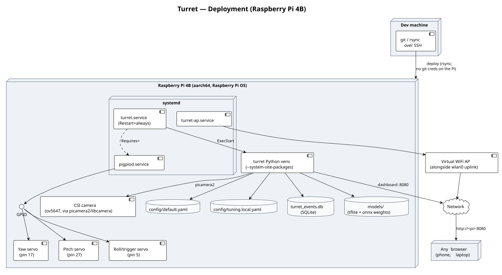

# Deployment & Operations

## Table of contents

- [Deployment topology](#deployment-topology)
- [Bring-up order, and why it's ordered that way](#bring-up-order-and-why-its-ordered-that-way)
- [Pre-run self-test](#pre-run-self-test)
- [Live tuning in production](#live-tuning-in-production)
- [Getting code onto the device](#getting-code-onto-the-device)
- [See also](#see-also)

This doc explains the *why* behind day-to-day operation. For exact
commands and flags, the root [`README.md`](../README.md) is the source of
truth — it's kept command-accurate on purpose, so this doc doesn't
duplicate syntax that would drift out of sync.

## Deployment topology

*(source: [`diagrams/deployment.puml`](diagrams/deployment.puml))*

Verified end to end against a real Raspberry Pi 4B (aarch64, Raspberry Pi
OS): three systemd units, `Restart=always` on the control loop, the
dashboard reachable over the network on port 8080. `turret-ap.service`
stands up a virtual WiFi access point alongside the Pi's normal uplink, so
the turret is reachable even without existing WiFi infrastructure nearby —
useful for a field/demo deployment where you can't assume a network.

Why systemd specifically, and what each unit-file choice is protecting
against, is covered in
[Stack & Rationale → Deployment stack](stack.md#deployment-stack).

## Bring-up order, and why it's ordered that way

The root README's bring-up sequence (axis calibration → HSV/ML tuning →
self-test → headless run → arm firing) isn't arbitrary — each step exists
to catch a specific class of problem before the next step makes it more
expensive to debug:

1. **Per-axis calibration** (`scripts/axis_test.py`) happens first and
   *alone*, one axis at a time, at a slow speed — because a wiring mistake
   here is a mechanical problem, and mechanical problems are much easier
   to spot in isolation than inside a running control loop.
2. **Detector tuning** (HSV ranges or ML confidence/model selection)
   happens before the full loop runs, so the *first* time detection and
   motion run together, detection is already trustworthy — otherwise a bad
   detection and a bad motion tune look identical from the outside.
3. **The pre-run self-test** (below) runs *after* individual tuning but
   *before* the full loop, specifically because it's cheap to run
   repeatedly and catches integration problems (does the fire-control mode
   actually match the roll axis hardware? does the camera actually open?)
   that per-axis and per-detector tools can't see.
4. **`fire.mode: log`** is the only mode used for every step above — firing
   is armed last, deliberately, once everything upstream has already been
   validated. See [Architecture → Safety model](architecture.md#safety-model).

## Pre-run self-test

`python -m turret --selftest` builds the same subsystems the real run
would (axes, camera, detector, fire control) and reports
`[PASS]/[WARN]/[FAIL]` per subsystem instead of starting the control loop.
It exists because, before it did, the only way to find out a subsystem was
misconfigured was to start the real loop and watch what broke — for the
roll axis specifically, that meant either a stepper spinning or a trigger
servo firing to find out.

What it checks, and the safety reasoning behind each:

- **Axes**: constructs every configured axis. Yaw/pitch get an automatic
  small nudge-and-return motion test (`--no-motion` to skip). **The
  trigger axis is never motion-tested by default** — only constructed and
  electrically verified — because "does this respond" and "actuate the
  firing mechanism" should never be the same check; `--actuate-trigger`
  opts in explicitly.
- **Camera**: opens it, reads several frames, confirms they're not `None`.
- **Detector**: builds it against the real config (this is where a missing
  model file or wrong ML runtime surfaces, with an actionable error rather
  than a stack trace) and runs one `detect()` call.
- **Fire control**: constructs the configured `FireControl` — this is
  where a `roll_spin` config against a servo-backed roll axis gets caught,
  same validation `make_fire_control()` always does (see
  [Architecture → the `FireControl` section](architecture.md#control--tracker-and-firedecider)),
  just surfaced here before the loop ever starts.

One real limitation worth knowing before trusting a `[PASS]`: a passing
yaw/pitch axis check means pigpio accepted and slewed the pulse-width
commands — it is **not** a claim that a physical servo actually moved.
There's no position feedback in this open-loop design, so that's the one
thing a `--selftest` run can't verify for you; only watching the hardware
can.

## Live tuning in production

The dashboard's tuning panel (see
[Architecture → The config system](architecture.md#the-config-system) for
the mechanism) is meant to make bring-up calibration — especially
`fire.min_area_px`, which needs retuning per detector backend and per
camera/mounting distance — a live, iterative process instead of a
config-edit-and-restart loop. In production this looks like: watch the
live preview with a real target at the intended engagement distance, drag
`min_area_px` until the overlay's in-range coloring matches reality, hit
**Save**. The saved value survives a real `systemctl restart` (verified
against the actual deployed service, not just the dev loop) because it's
loaded from `config/tuning.local.yaml` at startup — but it's still just a
value adjustment, never a `fire.mode` change; see
[Overview → Scope boundaries](overview.md#scope-boundaries-on-purpose).

## Getting code onto the device

The Pi's git remote is HTTPS with no stored credential by design (nothing
long-lived sits on a field-deployable device). For a one-off deploy, the
lowest-blast-radius option is syncing a known-good local working tree
directly over the same SSH access already used to administer the box,
rather than provisioning any new credential (a GitHub deploy key, a
personal-access token) onto it — that also sidesteps ever needing to
decide how "temporary" a temporary credential really is. Whatever
mechanism is used, the same verification applies before trusting a
restart: run the full test suite and `--selftest` **on the device itself**
(not just wherever the code was developed) before restarting the live
service — see [Pre-run self-test](#pre-run-self-test) above.

## See also

- [Architecture](architecture.md) — the mechanisms this doc assumes
- [Stack & Rationale → Deployment stack](stack.md#deployment-stack) — why systemd, why these unit-file settings
- [Root README](../README.md) — exact commands, flags, and wiring tables
