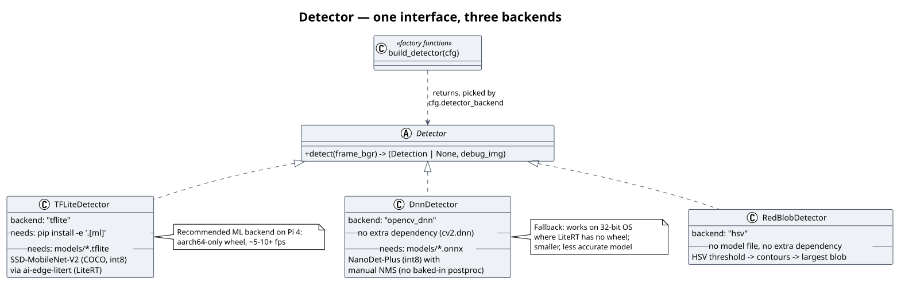

# Stack & Rationale

## Table of contents

- [Language and runtime](#language-and-runtime)
- [Core dependencies](#core-dependencies)
- [Detection: three tiers, not one](#detection-three-tiers-not-one)
- [Actuation: the `Axis` abstraction, and why the trigger moved to a servo](#actuation-the-axis-abstraction-and-why-the-trigger-moved-to-a-servo)
- [The dashboard: dependency-free by design](#the-dashboard-dependency-free-by-design)
- [Configuration and persistence](#configuration-and-persistence)
- [Dev tooling](#dev-tooling)
- [Deployment stack](#deployment-stack)
- [See also](#see-also)

## Language and runtime

**Python 3.10+** (developed and deployed on 3.13). The deciding factors,
roughly in order:

- Both hardware bindings this project needs — `pigpio` (GPIO/PWM) and
  `picamera2` (the Pi's camera stack) — are first-class Python libraries on
  Raspberry Pi OS, with `picamera2` specifically only really supported
  there (it wraps libcamera).
- OpenCV, NumPy, and the ML runtimes (`ai-edge-litert`, `cv2.dnn`) all have
  mature, well-documented Python APIs — this is the path of least
  resistance for computer vision work, on or off a Pi.
- It's readable and fast to iterate in, which matters for a course project
  where more than one person needs to work in the same codebase (this
  repo has three contributors) and the code itself needs to be legible as
  a deliverable, not just functional.

The trade-off is runtime performance, which is why the ML detection path
(the actual CPU-bound hot loop) is pushed into compiled inference engines
(LiteRT, `cv2.dnn`) rather than anything pure-Python — see
[Detection](#detection-three-tiers-not-one).

## Core dependencies

| Package | Used for | Why this one |
|---|---|---|
| `numpy` | Frame arrays, box math | The lingua franca every other CV/ML library here already speaks |
| `opencv-python` | HSV thresholding, contours, `cv2.dnn`, drawing, camera fallback | One dependency covers classic CV *and* one of the two ML backends *and* the debug overlay — hard to beat for coverage-per-install |
| `PyYAML` | `config/default.yaml` parsing | Human-editable, git-diffable, comments allowed — matters because this config is meant to be hand-tuned during bring-up |
| `Flask` | Dashboard API + static page server | Minimal, well-understood, in the stdlib-adjacent tier of "just works" — see [The dashboard](#the-dashboard-dependency-free-by-design) |
| `pigpio` (Pi-only extra) | Servo PWM, stepper GPIO | Runs pulse generation in a daemon (`pigpiod`) outside the Python process — pulses keep timing even if the control loop hitches |
| `picamera2` (apt-only) | Pi CSI camera capture | The only supported way to drive the Pi's libcamera-based camera stack from Python |
| `ai-edge-litert` (`ml` extra) | TFLite model inference | Google's current LiteRT runtime; publishes **aarch64-only** wheels — a real constraint, see below |
| `cv2.dnn` (bundled in opencv-python) | ONNX model inference | Already installed via `opencv-python`; the *only* reason the `opencv_dnn` detector backend costs zero extra install |

`picamera2` and `opencv-python`'s ARM wheels are the reason the Pi install
path (`README.md`'s "Raspberry Pi setup") uses
`python3 -m venv --system-site-packages .venv` plus `apt install
python3-opencv python3-picamera2` instead of a plain `pip install`: these
packages either have no PyPI wheel for the Pi's architecture at all
(`picamera2`) or benefit from apt's prebuilt, tested-against-this-exact-OS
binary instead of a slow/fragile source build.

## Detection: three tiers, not one

*(source: [`diagrams/detector-backends.puml`](diagrams/detector-backends.puml))*

One `Detector` interface, three implementations, selected by
`detector_backend` in config or `--detector` on the CLI:

| Backend | Model | Extra install | When to use it |
|---|---|---|---|
| `hsv` (default) | none — HSV threshold + contours | none | Zero dependencies, zero model files, works anywhere — the safe fallback and the original baseline |
| `tflite` (recommended ML) | SSD-MobileNet-V2 (COCO, int8) | `pip install -e '.[ml]'` | Best accuracy/speed on a Pi 4, **but `ai-edge-litert` only ships aarch64 Linux wheels** — no 32-bit support |
| `opencv_dnn` (ML fallback) | NanoDet-Plus (int8) | none (`cv2.dnn` is already there) | Same idea as `tflite`, smaller/less accurate model, works on 32-bit OSes where LiteRT has no wheel |

The three-tier design exists because **no single backend covers every
deployment target**: a fresh checkout with no model files downloaded still
works via `hsv`; a 64-bit Pi gets the best available accuracy via `tflite`;
a 32-bit OS (or anywhere `ai-edge-litert` fails to install) still gets *some*
ML detection via `opencv_dnn` rather than being stuck on HSV. Each backend
reports position/size in a different unit (HSV: contour area in px²; both
ML backends: bounding-box area, typically 5–20× larger at the same
distance for the same target) — this is why `fire.min_area_px` needs
retuning per backend, and exactly the kind of thing the live-tuning
dashboard's `min_area_px` slider exists to make painless instead of a
config-file-and-restart cycle.

An `onnx`/YOLO backend (via `onnxruntime`) was considered and deliberately
left out — YOLO-family models benchmark around 1 fps on a Pi 4 CPU in
public benchmarks, not worth the added dependency for hardware this
project explicitly targets.

## Actuation: the `Axis` abstraction, and why the trigger moved to a servo

Two real backends behind one `Axis` interface:

- **`ServoAxis`** — pigpio PWM, targeting SG92R-family hobby servos. The
  angle→pulse-width math and the slew-limited motion model are ported from
  the vendored [ESP32Servo](https://github.com/madhephaestus/ESP32Servo)
  Arduino library's `Servo` class and Sweep example — a well-tested,
  already-correct reference rather than re-deriving PWM timing from
  scratch.
- **`StepperAxis`** — a 28BYJ-48 stepper via a ULN2003 driver, half-stepping,
  driven by a background thread so the main control loop's `update(dt)`
  call never blocks on step timing.

The roll (trigger) axis started on the stepper backend, because the
original firing mechanism was a continuously-spinning barrel — something a
±90°-travel hobby servo genuinely can't do. It later moved to a servo-based
**pull-and-release** trigger (`fire.mode: servo_pull`: pull to an angle,
hold, release) once the physical mechanism changed to something a servo
*can* drive. Rather than deleting stepper support, `Axis.supports_spin`
(a class attribute, `True` only on `StepperAxis`/`MockAxis`) lets
`make_fire_control()` validate that `fire.mode: roll_spin` is only ever
paired with hardware that can actually spin continuously — both mechanisms
stay supported, and a mismatched config fails loudly at startup instead of
silently at the first shot. See
[Architecture → Safety model](architecture.md#safety-model).

## The dashboard: dependency-free by design

The dashboard is a Flask dev server (explicitly not a production WSGI
server — this is a local-network tool, not internet-facing) serving one
static HTML/CSS/JS page with **no frontend framework, no build step, no
npm**. The live camera preview is plain **MJPEG multipart** streaming
(`multipart/x-mixed-replace`), not WebSockets or WebRTC — an `` just works in any browser with zero client-side
JavaScript needed to receive it, at the cost of a little bandwidth
efficiency that doesn't matter on a local network. The tuning panel is
`fetch()` + `<input type=range>` — the same reasoning: the simplest thing
that works, given the dashboard's actual job is "one operator, one local
network, glance at it during bring-up."

## Configuration and persistence

Three distinct storage mechanisms, chosen per how each thing is actually
used:

- **`config/default.yaml`** (YAML, git-tracked): the canonical, reviewed
  configuration. Human-editable and git-diffable on purpose — config
  changes should go through the same review as code.
- **`config/tuning.local.yaml`** (YAML, gitignored): live-tuning's optional
  save target. A *separate* file rather than writing back into
  `default.yaml` specifically so a live deployment's working tree can
  never silently drift from what's committed — this was a real failure
  mode encountered deploying to the Pi (an earlier, uncommitted prototype
  file sitting in the working tree with no corresponding commit). Session
  tuning is explicit-opt-in-to-persist (a Save button, not autosave) for
  the same reason: durable changes should be a deliberate action, not an
  accidental side effect of dragging a slider.
- **`turret_events.db`** (SQLite, gitignored runtime artifact): the
  dashboard's sighting/fired event log. SQLite because the write pattern
  is low-volume/append-only and the read pattern is "give me the last N
  events" — a full client-server database would be pure overhead, and a
  flat file/CSV would lose the indexed `ORDER BY ts DESC LIMIT` query
  `EventStore.recent()` relies on.

See [Architecture → The config system](architecture.md#the-config-system)
for how `LiveTunable` makes the live-tuned values available to
already-running code with no changes to that code.

## Dev tooling

- **devenv/Nix** (`devenv.nix`, `devenv.yaml`, `devenv.lock`): a
  reproducible dev environment across every contributor's machine —
  `devenv shell` installs the exact Python version and native libraries
  `opencv-python`'s wheel needs (`libGL`, `glib`, X11 libs) without anyone
  hand-installing system packages. Not used on the Pi itself, where the
  apt + `--system-site-packages` venv path is more appropriate (see
  [Core dependencies](#core-dependencies)).
- **pytest + ruff**: standard, fast, no-configuration-needed choices for a
  project this size; nothing about the testing or linting story needed
  anything more elaborate.
- **The mock-hardware layer** (`MockAxis`, in-memory video clips for
  `CvCamera`, fake interpreters for the ML detectors) is itself a tooling
  decision, not an accident — see
  [Architecture → Test strategy](architecture.md#test-strategy).

## Deployment stack

**systemd**, not cron or a manually-started process, for the actual Pi
deployment (`turret.service`, `turret-ap.service`, both depending on the
already-Pi-standard `pigpiod.service`). The specific choices that matter:

- `Restart=always` (not `on-failure`) — the control loop's own design
  exits cleanly (code 0) when the camera stops yielding frames, and that
  case should still be retried, not treated as a terminal failure.
- `Requires=pigpiod.service` + `After=` ordering — GPIO axes literally
  cannot construct without the pigpio daemon reachable; failing fast in a
  well-defined dependency order beats a racy, hard-to-debug startup.
- `StartLimitIntervalSec=0` — the CSI camera can lag the rest of boot;
  systemd's default restart-limit would otherwise give up before the
  camera's ready.

See [Deployment & Operations](deployment-and-ops.md) for the operational
detail (bring-up order, the self-test, live tuning in production).

## See also

- [Architecture](architecture.md) — how these pieces fit together at runtime
- [Overview](overview.md) — the capability list this stack supports
- [Deployment & Operations](deployment-and-ops.md) — this stack, running for real
